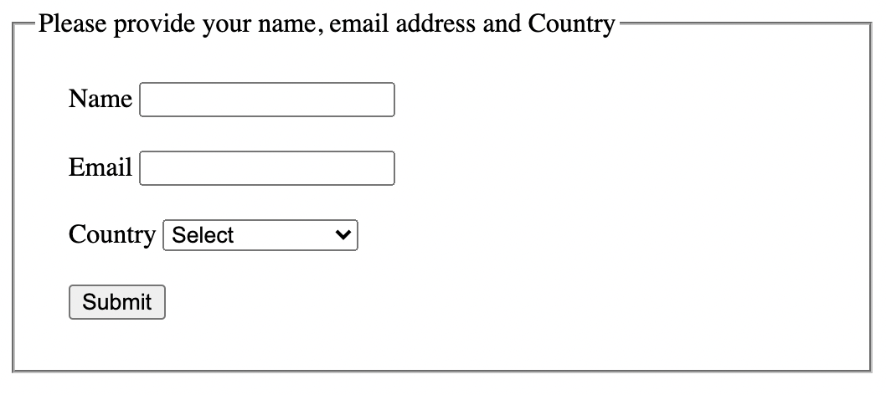
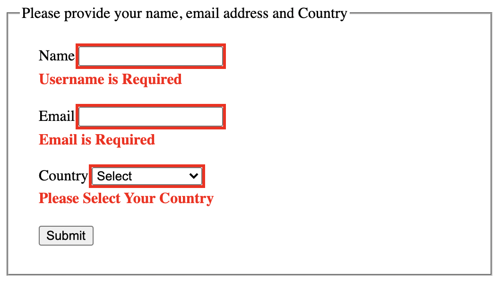
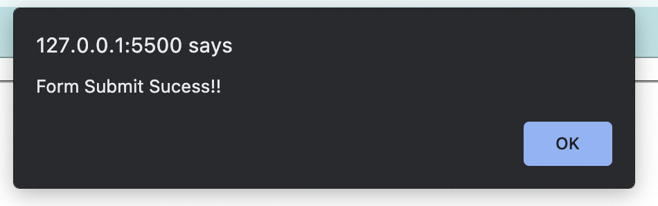

## Form Validator Interview Question

1. Using Semantic HTML, create a simple user form as shown below:
   

2. The fields mentioned in the form are all required to be filled by the user.

3. On Submit the fields should be validated before success.

4. The default semantic HTML validation should be blocked and instead should be validated as:

- **Name:** Name is Required filed and should be of length between 2 to 65 characters. If these conditions failed then the error should be displayed against the Name filed stating _“Username is Required”_ or _“Username must be at min 2 characters and at max 65 characters long”_ as per the type of error.

- **Email:** Name is Required filed and should be of valid format i.e. should start with numbers or characters followed by _@_ then some character and then a period (.) followed by few more characters. Upon Error, it should display a message against the filed as "Email is required" or _"Please enter a valid email"_ respectively.

- **Country:** It is filed with a drop-down to select a value. Filed is required and should have any value selected other than the default value. In case of failure, it should display a message against the filed as _"Please Select Your country"_.

- The validation Error should look like this:
- 

5. Upon successful validation:

- There should be no error message and all the fields should look back normal.

- There should be an alert message stating that the form is submitted successfully.

- All the fields should be blank.

  
